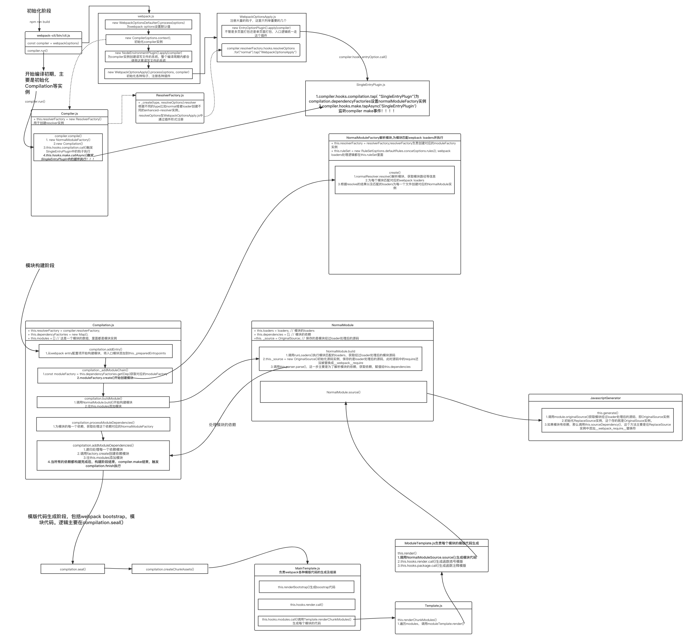

# 尝试自己实现一个 mini-webpack

### webpack 打包主流程

当我们运行`npm run build`命令的时候，npm 会从`./node_modules/webpack/bin/webpack`开始，找到并执行`webpack-cli/bin/cli.js`，也就是 webpack 编译的入口文件。

- [x] 源码浅分析
  - 入口文件分析，转成 AST 抽象语法树（返回路径、es5 code、相关依赖）
  - 构造依赖的图谱
  - generate 最终的代码
- [ ] webpack 完整主流程实现
- [ ] loader 手写实现
- [ ] plugin 手写实现
